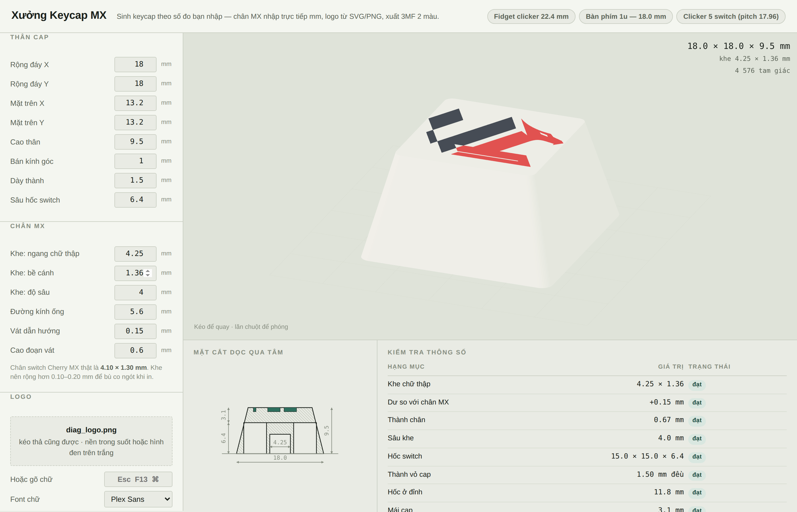
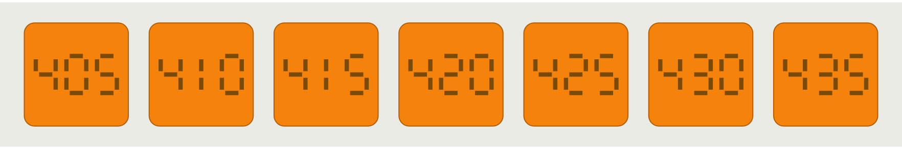
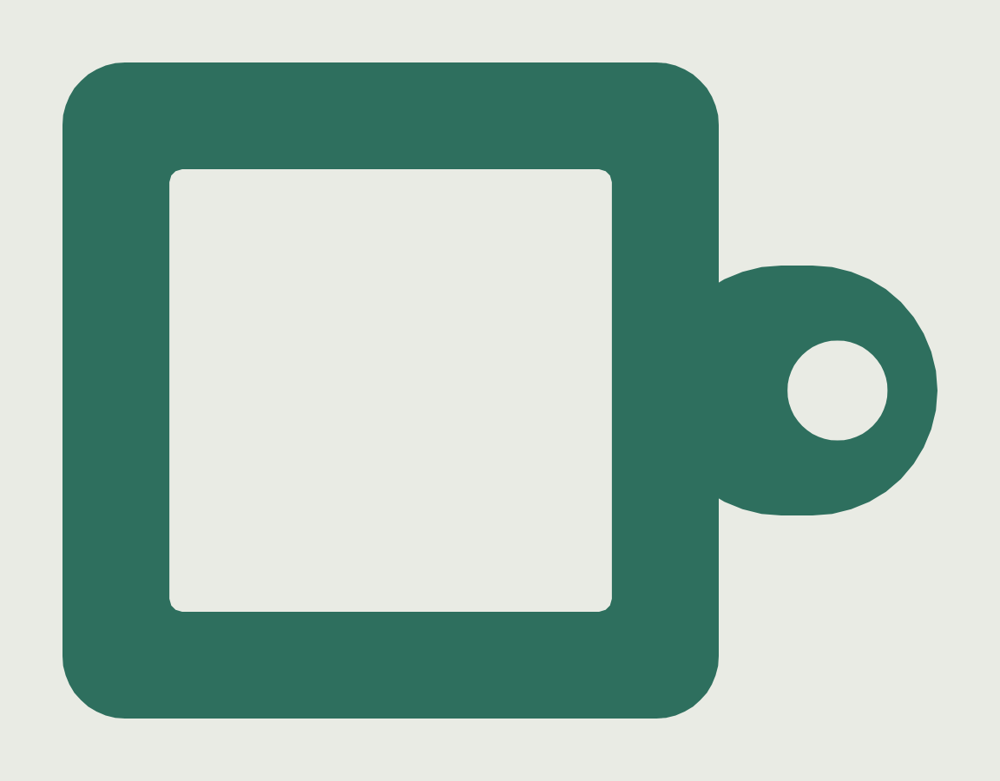

# Keycap Generator

Parametric Cherry MX keycap generator that runs in the browser. Type the millimetres
you actually measured with calipers, drop in an SVG or PNG, and export a two-colour
`.3mf` that opens in Bambu Studio ready to print.

**[▶ Open the tool](https://silpdev.github.io/keycap-generator/)** — no install, no
sign-up. One HTML file that also works offline: save the page and open it from disk.



> The interface is in Vietnamese. Every control is a number in millimetres, so it
> stays usable either way — and the tolerance table tells you in plain terms when a
> value will not print. Translations are welcome.

## Why another one

Most keycap generators lock you to keyboard units (1u, 1.25u, …) and hide the stem
behind a vague ± button. That is fine for a keyboard and useless for a fidget
clicker, a macropad shell, or any enclosure where you measured the switch pitch
yourself. This one asks for the numbers directly and then checks them:

- **Free dimensions.** Bottom footprint, top face, height, corner radius, wall
  thickness, cavity depth — all typed in mm. Non-square caps included.
- **The MX stem in numbers.** Cross span, arm width, slot depth, tube diameter,
  push-on chamfer. A real Cherry MX post measures **4.10 × 1.30 mm**; a printed slot
  wants **0.10–0.20 mm** more than that to survive shrinkage. The table flags a slot
  that is too tight *before* you waste an hour of print time.
- **Legend from any image.** SVG or PNG/JPG/WebP, traced to real contours with
  holes and islands preserved. Raised, recessed inlay, or cut all the way through.
- **Legend from typed text.** `Esc`, `F13`, `⌘` — pick a face, a weight and letter
  spacing. The text is rasterised and fed through the same tested tracer the images
  go through, so no font-outline parser and no new dependency.
- **A calibration plate.** One plate of test pieces whose slots step through a range,
  each with its own width engraved on it. Print it once, keep the number.
- **A switch holder.** A base you press a real MX switch into, so there is something
  to test the calibration pieces and the finished caps against — with a keyring lug,
  because one switch on a base is a fidget toy whether you meant it to be or not.
- **Two, three or four colours.** The artwork already knows what colour it is, so
  the logo is split by its own colours rather than by hand: cluster, trace each
  cluster, one part and one filament slot per ink. Cap and legend parts each carry
  their filament, and the file declares the slots so the assignment survives import.

## What it checks for you

The tolerance table on the right is the point of the tool. It recomputes on every
keystroke and explains each failure with the number you need to change:

| Check | Fails when |
|---|---|
| Cross slot | clearance over the 4.10 mm post is under 0.05 mm or over 0.40 mm |
| Stem wall | tube wall thinner than 0.50 mm — one extrusion, cracks off |
| Slot depth | shallower than 3.4 mm, the cap works loose |
| Switch cavity | narrower than 13.4 mm at the rim, the cap bottoms out on the housing |
| Cap wall | thinner than 0.80 mm, the skirt prints hollow and separates |
| Cavity at the ceiling | under 9.5 mm, the switch's upper housing fouls the taper |
| Roof | under 1.2 mm, or too thin for the engraving depth |
| Legend vs top face | legend wider than the top face |
| Thinnest stroke | any legend region narrower than two extrusion widths |
| Print orientation | face-up when it does not have to be (see below) |

## Colours come from the artwork

A brand mark carries its colours in the file. Asking which regions are navy and
which are red would be asking you to re-enter what the PNG already says, so
`src/palette.mjs` clusters the artwork's colours instead and traces each cluster
separately. Drop in a two-colour wordmark, pick "3 màu", and the filament swatches
come up filled with the logo's own hex values.

Two details decide whether that is usable rather than merely clever:

**It is deterministic.** k-means from random seeds gives a different answer each
time you drop in the same file, which is intolerable in a tool whose output you
print. The seeds come from the most populated buckets of a coarse colour
histogram, chosen farthest-first, weighted by population — no randomness anywhere,
so the same file always yields the same inks in the same order.

**The colours stay registered.** Every ink shares one fit, computed from all inks
together. Scaling and centring each colour on its own bounding box is the obvious
implementation and it pulls the logo apart — each colour grows to fill the whole
logo size. There is a test for exactly that.

Asking for more inks than the artwork has does not invent them: a third "colour"
made only of the antialiased pixels along a boundary is dropped, and the panel says
it found two. Boundaries between inks use inverse-distance membership rather than a
hard per-pixel label, so the contour lands where the colours actually meet with
sub-pixel accuracy instead of tracing a staircase.

Three colours means three filament changes per layer in the legend's layers. That
is the printer's problem, not the file's, but it is worth knowing before you slice.

## The check that costs the most prints

A two-colour legend fails silently. The mesh is perfect, the slicer accepts it
without a word, and the thin strokes come out **in the cap's colour** — you get
faint relief where the letters should be. It happened here with a two-tier
wordmark: the big letters printed in the second filament and the small line under
them printed in white, because a region narrower than one extrusion cannot be laid
down in its own filament, and nothing downstream can fix that.

So `src/stroke.mjs` measures it. It rasterises the placed legend at 0.01 mm,
takes a Euclidean distance transform, and reports the width of each region **at its
widest point** — the max inscribed circle diameter. If even the widest point of a
letter is under two extrusion widths, that letter has no chance. The verdict comes
with the number you actually need: the logo width that *would* work, scaled off the
conservative end of the measurement, and whether that width even fits the cap's top
face. On an 18 mm 1u cap it usually does not, which is the honest answer — drop the
small line, or move to a bigger cap.

`test_stroke.mjs` checks the measurement against shapely's exact erosion on the
real logo that failed (agreement within one raster pitch), against bars, discs and
an annulus where the answer is not open to interpretation, and confirms that the
size it recommends really does clear the threshold when you scale to it.

## Calibrating the slot, once

Slot clearance is the one number that cannot be derived. It depends on the filament,
the nozzle, the flow calibration and how your slicer rounds a 1.3 mm feature, and
being 0.05 mm out is the difference between a cap that clicks on and one that splits
the stem or falls off. So don't guess:

1. Set the arm width, slot depth, tube diameter and chamfer you intend to use.
2. Export the calibration plate — seven pieces from 4.05 to 4.35 mm by default.
3. Print it in one colour, **supports off**, ~20 minutes. Print the switch holder
   with it if you have no loose switch mounted in anything.
4. Push each piece onto a real switch. The one that goes on firmly and comes off
   without a fight wins.
5. Read the number engraved on it and type it into *cross span*.



The number is in hundredths of a millimetre — `425` is a 4.25 mm slot — and it is
engraved on the face that prints against the build plate, the crispest surface the
printer has. Each piece is built from the same `buildCapShell` and `buildStem` as a
real cap, so what the plate measures is what the cap will do; the test suite
re-measures the slot back out of the finished mesh to make sure the piece really is
the width printed on it.

## The switch holder

Cherry's plate-mount spec is the same for every MX and MX clone: a **14 × 14 mm**
square cutout in a plate **1.5 ±0.1 mm** thick, with two clips on the bottom housing
that spring outward and latch underneath. Plate top to PCB top is 5 mm, so about
3.5 mm of housing hangs below the plate and a plate-mount switch's pins add roughly
3 mm more — all of which has to be empty space.

Two things the generator does with that. The cutout defaults to **14.15 mm**, not
14.00: an FDM hole comes out undersize, and a cutout that is 0.1 mm tight will not
take the switch at all. And the part is modelled plate-down, so the cutout lands in
the first layer, the clearance well opens towards the nozzle, and the outer wall
leans *outward* as it rises — the self-supporting direction. The result has a wide
stable foot, no overhang anywhere, and no support to dig out of the well. Turn it
over after printing and the plate is on top where the switch goes in.



The far end of the well is closed by a **floor**. The first version left it open —
the well cut clean through — which made the base a tube: the switch and its pins
showed through both faces, and on a keyring the pins catch on everything. The floor
is the one feature the slicer has to bridge, a single span across the cavity anchored
on all four walls, and it is the *only* unsupported surface in the whole part (a full
overhang audit of the boolean result finds 268 mm² of horizontal down-face at the
floor and nothing else at any angle). **Do not enable support** — by that layer the
cavity is sealed, and support inside it can never come out. Set the floor to 0 to get
the open frame back, which is still the right thing for a bench tester you want to
poke wires into; a closed floor has no way to release the switch again, so set a
*push-out hole* of 5–6 mm if you want to be able to drive it back out with a rod.

The sides are straight. A flared foot is steadier on a bench and looks like a
doorstop on a keyring, and it was never a printing requirement — a vertical wall is
exactly as self-supporting as one leaning outward. `footGrow` brings it back.

The keyring lug is a tab sticking out at plate level, not a hole through the plate:
between the switch cutout and the rim there are only 3.4 mm of plate, and 1.5 mm of
PLA with a 3 mm hole in it is a hinge, not a lug. So the tab is 3 mm thick — twice
the plate — overlaps 2 mm into the body, and ends in a semicircle around a ⌀3.2 mm
eye for a standard split ring, with 1.6 mm of material beyond it and 2.4 mm each
side. It sits on the build plate as part of the first layer, so it costs nothing in
print time and has no overhang either. Turn it off with the checkbox if you just
want a bench tester.

The checks are the same idea as the keycap's: it will tell you when the cutout is
too tight to take a switch or too loose to hold one, when the plate is outside the
1.2–1.8 mm the clips are cut for, when the well is too shallow for the housing and
pins, and — with several cells — when two wells are about to merge into each other.
The lug has its own: too little material beside or beyond the eye, a tab under 2 mm
thick, an eye too small for a split ring, or a lug so short that the eye runs into
the body wall (which flares as it rises, so the check measures it at the top of the
tab, where it is closest).

## Three things it gets right that are easy to get wrong

**The cavity follows the taper.** A tapered shell with a straight vertical cavity
pinches the wall as it rises: on a 17.5 mm cap tapering to 12.5 mm, a 1.6 mm wall at
the rim becomes **0.34 mm** at the top of the cavity. That is thinner than one
extrusion, the slicer prints nothing there, and the skirt comes off the cap as a
separate ring. Here the cavity is lofted parallel to the outside, so the wall keeps
its thickness for the full height — the way commercial caps are built.

**It flips the cap for printing.** Modelled sitting on its open rim, the cap's
cavity roof is a ~300 mm² internal bridge and the slicer asks for supports — which
would land inside the cavity and the stem slot and ruin the fit. Exported top-face
down, the same cap has **3.6 mm²** of overhang (measured layer by layer at 0.2 mm),
the top surface comes off the build plate glossy, and a recessed legend prints as
the first layers, which is what makes a crisp two-colour inlay. A raised legend
cannot be flipped, so that mode stays face-up and says so.

**No CSG, and no repair needed.** Cap, stem and legend are written as separate parts
of one 3MF object — normal parts add, `negative_part` subtracts, and the slicer does
the booleans. So there is no WASM CSG kernel to load, and every part only has to be
a closed solid on its own. They are: the test suite audits each part's edges without
letting any mesh library repair them first.

## Tests

```bash
npm test      # no dependencies — the core and the tests use only Node builtins
```

- **`test_tri.mjs`** — triangulation with holes. Compares the *summed triangle area*
  against the true area (outer minus holes) over 9 cases: 1, 2, 4, 20 and 30 holes,
  a ring with thin radial slits, a 60-point star hole. Deviation must be 0.00% —
  a positive deviation means a hole got filled in.
- **`test_vec.mjs`** — image tracing. Rasterises a known polygon and recovers it:
  area within 0.1%, worst-case geometric deviation under 0.02 mm. Plus a donut and
  a separate island to cover hole nesting.
- **`test_export.mjs`** — every part destined for the 3MF, over **27 combinations**
  of preset × legend mode × print orientation: each edge must appear exactly twice,
  no face may repeat a vertex, and the signed volume must be positive. Deliberately
  without mesh repair — a slicer quietly repairing a hole is how one reached the
  printer during development.
- **`test_cal.mjs`** — the calibration plate. Measures each piece's slot back out of
  its mesh and requires it to match the number engraved on it to 1e-6 mm, checks the
  seven-segment bars never touch (a shared vertex would weld into a non-manifold
  edge), and audits every part the way `test_export.mjs` does.
- **`test_holder.mjs`** — the switch holder. Measures the cutout, the plate thickness
  and the free depth below the plate back out of the mesh and checks a real switch
  fits in them, confirms the outer wall never narrows as z rises (a foot taper
  pointing the wrong way would need support everywhere), and feeds six deliberately
  broken configurations through the checks to make sure each one is actually caught.
- **`test_stroke.mjs`** — legend stroke widths, against shapely's exact
  max-inscribed-circle diameters on the real two-tier logo that printed with its
  lower line in the wrong colour, plus bars, discs and an annulus with known
  answers. Also checks the recommended logo size actually clears the threshold, and
  that the advice tracks the nozzle.
- **`test_palette.mjs`** — colour splitting: recovers the exact colours from a
  synthetic two-ink mark, proves the ink fields are disjoint and cover everything,
  proves the same file twice gives identical results, and on the real brand mark
  checks the parts get extruders 1/1/2/3, the 3MF declares three filaments in the
  logo's own colours, and — the one that matters — that the inks share one fit
  instead of each being scaled to fill the frame.
- **`test_mesh.mjs`** — writes each part to `out/*.stl` and prints the dimensions.

## Development

```bash
npm install     # only for the dev server
npm run dev     # vite, hot reload

npm run bundle  # rebuild docs/index.html (the site and the offline copy)
npm test
```

CI runs the tests and then fails if `docs/index.html` does not match `src/`.

| File | Does |
|---|---|
| `src/geom.mjs` | Rounded rects, the MX cross, ear-clipping triangulation with hole bridging, the `Mesh` class, cap shell / stem / legend prism builders |
| `src/vectorize.mjs` | Marching squares over the alpha field, Douglas–Peucker, hole classification by nesting depth |
| `src/export3mf.mjs` | Zip writer (STORE + CRC32), Bambu-flavoured 3MF, binary STL |
| `src/build.mjs` | Presets, part assembly, print orientation, plate layout |
| `src/calibration.mjs` | Seven-segment numerals and the slot calibration plate |
| `src/holder.mjs` | MX plate-mount holder base, with its own fit checks |
| `src/stroke.mjs` | Distance transform over the legend, to catch strokes too thin to print in their own colour |
| `src/palette.mjs` | Deterministic colour clustering, one coverage field per ink |
| `src/app.js` | UI: WebGL preview, section drawing, tolerance table |
| `src/shell.html` | Markup and CSS, shared by the dev build and the bundle |
| `bundle.mjs` | Inlines everything into `docs/index.html` |
| `tools/make-sample-logo.mjs` | Regenerates the bundled sample legend |

Nothing is vendored: the triangulation, the image tracing, the zip writer and the
3MF writer are all in the four files above.

## Two colours in Bambu Studio

The legend part carries `<metadata key="extruder" value="2"/>` in
`model_settings.config`, which is how Bambu assigns a filament per part. But a
project with only one filament flattens that back to filament 1 and the cap comes
out one colour — so the export also embeds a minimal `project_settings.config`
declaring two filament slots in the colours you picked. It contains only the
filament arrays, no printer or print preset, so your machine profile is untouched.
If Bambu asks whether to load the project's settings, say yes.

Two colours still need two filaments in the project, three need three. Without an
AMS or enough slots, no file can produce them.

The `.stl` button is there for single-colour caps and nothing else. STL has no
concept of a negative part, so a recessed or through legend simply is not in the
file — you get a blank cap. The tool says so when you click it. The calibration
plate has no STL export at all for the same reason: seven identical unlabelled
pieces are worse than no plate, because you cannot tell which one fitted.

## Credits

The idea came from [vostoklabs/SVG-keycap-generator](https://github.com/vostoklabs/SVG-keycap-generator),
which is worth a look if you want authored keycap profiles and keyboard-standard
sizes. No code is shared between the two projects — this one is written from scratch
around typed dimensions and a tolerance check.

Preset dimensions were taken with calipers from caps that fit real switches. The
bundled sample legend is generated by `tools/make-sample-logo.mjs`; bring your own
artwork and check its licence before printing or sharing it.

## Tiếng Việt

[README.vi.md](README.vi.md) — bản tiếng Việt đầy đủ.

## Licence

MIT — see [LICENSE](LICENSE).
